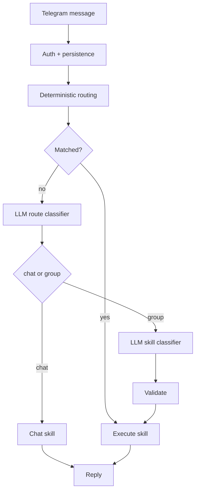

# openLight


Tiny AI control plane for your personal infrastructure.

`openLight` keeps host access explicit and auditable, stores state in SQLite, and uses an optional LLM fallback for broader natural-language routing and chat. It is not a general-purpose shell agent.

[Architecture](./ARCHITECTURE.md) · [Changelog](./CHANGELOG.md) · [Pi 5 Latency](#raspberry-pi-5-latency-snapshot) · [Install on Raspberry Pi](#raspberry-pi-setup) · [Configs](./configs/) · [Systemd Unit](./deployments/systemd/openlight-agent.service)

## Why

`openLight` is built for a narrow operating model:

- deterministic routing before any LLM fallback
- explicit, auditable skills instead of general shell access
- one Go binary plus one YAML config
- SQLite persistence instead of a larger service footprint
- deployment that fits Raspberry Pi and other modest Linux hosts

Best suited for:

- Raspberry Pi home servers
- Telegram-based maintenance bots
- local-first assistants backed by Ollama
- simple remote ops with OpenAI or a custom HTTP LLM adapter

## At a Glance

| Area | Choice |
| --- | --- |
| Interface | Telegram and CLI |
| Runtime | single Go binary |
| State | SQLite |
| Routing | deterministic first, optional two-stage LLM fallback |
| LLM providers | Ollama, OpenAI, generic HTTP |
| Host actions | explicit file, system, service, notes, and optional workbench skills |
| Deployment | systemd-friendly, Raspberry Pi-first |

## How It Works

Each message goes through auth, persistence, deterministic routing, optional LLM fallback, validation, skill execution, and reply delivery.
If `llm.enabled: false`, the runtime stays deterministic-only and the `chat` skill is not registered.



The LLM is intentionally constrained:

- it can classify `chat` vs a skill group
- it can choose one concrete skill inside the chosen group
- it can extract minimal arguments for that skill
- it cannot bypass validation or access arbitrary shell tools

See [ARCHITECTURE.md](./ARCHITECTURE.md) for the full runtime reference.

## Raspberry Pi 5 Latency Snapshot

Single-request snapshot recorded on March 14, 2026 for the same natural-language input:
`что там по статусу системы`

| Path | Route classification | Skill classification | Skill execution | Total |
| --- | --- | --- | --- | --- |
| Ollama `qwen2.5:0.5b` on Pi 5 | 19.84s | 22.56s | 0.15s | 42.55s |
| OpenAI `gpt-4o-mini` from Pi 5 | 1.35s | 1.77s | 0.15s | 3.28s |

What this shows:

- the `status` skill itself is fast; in both runs it completed in about `150ms`
- most of the delay sits in LLM route and skill classification, not in the host action
- this is why `openLight` stays deterministic-first and uses the LLM only where classification is actually useful

This is a transparent snapshot, not a full benchmark suite.
Absolute numbers will vary with model choice, network, prompt size, and Raspberry Pi thermals.

## Quick Start

Requirements:

- Go 1.25+
- Telegram bot token
- Linux host for systemd-backed service skills
- optional: Ollama or an OpenAI API key

1. Copy a config template to `agent.yaml`.

| Template | Use when |
| --- | --- |
| [configs/agent.example.yaml](./configs/agent.example.yaml) | minimal baseline, LLM disabled |
| [configs/agent.openai.example.yaml](./configs/agent.openai.example.yaml) | OpenAI-backed routing and chat |
| [configs/agent.rpi.ollama.example.yaml](./configs/agent.rpi.ollama.example.yaml) | Raspberry Pi deployment with local Ollama |

```bash
cp configs/agent.example.yaml ./agent.yaml
# or:
cp configs/agent.openai.example.yaml ./agent.yaml
```

For Raspberry Pi, use [Raspberry Pi Setup](#raspberry-pi-setup).
`make init-rpi-config` creates `configs/agent.rpi.yaml` from the bundled Pi template.

2. Fill the required settings.

- `telegram.bot_token`
- at least one of `auth.allowed_user_ids` or `auth.allowed_chat_ids`
- `storage.sqlite_path`
- `access.hosts.*` when you want to manage services on another host over SSH
- `files.allowed` for safe file access
- `services.allowed` for allowed services
- `workbench.*` only if you want temporary code execution or allowlisted executables
- `llm.*` and `chat.*` only if you want LLM routing and chat

Keep runtime secrets out of version control.
For OpenAI, prefer `OPENAI_API_KEY` over committing `llm.api_key`.

3. Run the agent.

```bash
go run ./cmd/agent -config ./agent.yaml
```

Useful first commands:

- `/skills`
- `/help status`
- `/status`
- `read /tmp/openlight/app.conf`

Common English and Russian variants such as `show logs tailscale` or `покажи логи tailscale` are handled by deterministic routing even when `llm.enabled: false`.
Enabling the LLM broadens ambiguous natural-language routing and adds the `chat` skill.

## Raspberry Pi Setup

<details>
<summary><strong>Open the short install path</strong> — from clone to a running systemd service</summary>

This path assumes:

- you run the deploy commands from your laptop or workstation
- the Pi is reachable over SSH
- the SSH user has `sudo`
- optional for local LLMs: Docker with the `docker compose` plugin is installed on the Pi

1. Create the Raspberry Pi config and edit it.

```bash
make init-rpi-config
```

Then open `configs/agent.rpi.yaml` and set at least:

- `telegram.bot_token`
- `auth.allowed_user_ids` or `auth.allowed_chat_ids`
- `storage.sqlite_path`
- `files.allowed`
- `services.allowed`

If you do not want Ollama on the Pi, either set `llm.enabled: false` or start from `configs/agent.openai.example.yaml` instead.

2. Point the deploy helpers at your Pi.

```bash
export PI_USER=pi
export PI_HOST=raspberrypi.local
export PI_DEST_DIR=/home/pi
```

3. Optional: if you want local Ollama on the Pi, start it there first.

```bash
scp deployments/docker/ollama-compose.yaml "$PI_USER@$PI_HOST:/home/$PI_USER/ollama-compose.yaml"
ssh "$PI_USER@$PI_HOST" "docker compose -f /home/$PI_USER/ollama-compose.yaml up -d ollama"
ssh "$PI_USER@$PI_HOST" "docker compose -f /home/$PI_USER/ollama-compose.yaml run --rm ollama-pull"
```

The bundled compose file pulls `qwen2.5:0.5b`.
Skip this step if you use OpenAI or deterministic-only mode.

4. Upload config, binary, and systemd unit.

```bash
make deploy-rpi-all
```

This will:

- upload `configs/agent.rpi.yaml` to `/etc/openlight/agent.yaml`
- build `openlight-agent` for `linux/arm64`
- copy the binary to `/home/pi/openlight-agent`
- install or restart `openlight-agent.service`

5. Check that the service is alive.

```bash
ssh "$PI_USER@$PI_HOST" "systemctl status openlight-agent --no-pager"
ssh "$PI_USER@$PI_HOST" "journalctl -u openlight-agent -f"
```

6. Talk to the bot in Telegram.

- `/skills`
- `/status`
- `logs tailscale`

</details>

## Configuration

### Surface

| Section | Purpose |
| --- | --- |
| `telegram.*` | transport settings, polling or webhook mode |
| `auth.*` | user and chat allowlists |
| `storage.*` | SQLite database location |
| `access.*` | optional named SSH hosts for remote service management |
| `files.*` | allowed roots and read/list limits |
| `services.*` | allowed services plus log line and log size limits |
| `workbench.*` | optional temporary code execution and allowlisted files |
| `llm.*` | optional LLM provider, thresholds, and routing limits |
| `chat.*` | free-form chat history and response bounds |
| `agent.*` | request timeout |
| `log.*` | log verbosity |

### Telegram

`openLight` supports two transport modes:

- `telegram.mode: "polling"` for the simplest deployment
- `telegram.mode: "webhook"` for public HTTPS deployments

Webhook mode requires:

- a public `https://...` URL in `telegram.webhook.url`
- a local listen address in `telegram.webhook.listen_addr`
- a Telegram-reachable endpoint path

Using `telegram.webhook.secret_token` is recommended for webhook deployments.

### CLI

Alongside Telegram, `openLight` also ships a local CLI binary that drives the same agent runtime through stdin/stdout.
This is useful on Raspberry Pi when you want quick end-to-end checks without sending Telegram messages.
The CLI reuses the same YAML config, SQLite state, router, skills, and auth rules; by default it picks the first allowed user/chat id from `auth.*`.

Examples:

```bash
go run ./cmd/cli -config ./agent.yaml -exec "service jitsi-web"
go run ./cmd/cli -config ./agent.yaml -exec "user list"
printf 'ping\nstatus\nservices\n' | go run ./cmd/cli -config ./agent.yaml
go run ./cmd/cli -config ./agent.yaml -smoke
go run ./cmd/cli -config ./agent.yaml -smoke -smoke-routing
go run ./cmd/cli -config ./agent.yaml -smoke-all
```

Smoke mode prints a table with one row per check.
By default `-smoke` runs a broad but safe suite and marks disruptive checks like service restarts as `SKIP`.
Use `-smoke-routing`, `-smoke-chat`, `-smoke-restart`, or `-smoke-all` when you want to include those rows in the actual execution path.

<details>
<summary>Latest successful <code>-smoke-all</code> run on Raspberry Pi</summary>

This is a real end-to-end run against the current Raspberry Pi config, including remote Jitsi services on the VPS.

```text
| Check                      | Command                                                                                       | Status | Duration | Summary                                                                                                 |
|----------------------------|-----------------------------------------------------------------------------------------------|--------|----------|---------------------------------------------------------------------------------------------------------|
| core.start                 | start                                                                                         | PASS   | 4ms      | openLight is ready. | You can write normally and I will answer through the local LLM when chat mode ... |
| core.ping                  | ping                                                                                          | PASS   | 4ms      | pong                                                                                                    |
| core.skills                | skills                                                                                        | PASS   | 4ms      | Available skill groups: | - Chat: 1 skill(s). Use skills chat | - Notes: 3 skill(s). Use skills note... |
| core.help                  | help ping                                                                                     | PASS   | 4ms      | ping: Quick connectivity check. | Usage: ping | Aliases: healthcheck                                    |
| system.status              | status                                                                                        | PASS   | 155ms    | Hostname: raspberry | CPU: 0.0% | Memory: 1.1 GiB used / 7.9 GiB total | Disk: 863.4 GiB free / 916.... |
| system.cpu                 | cpu                                                                                           | PASS   | 158ms    | CPU usage: 0.0%                                                                                         |
| system.memory              | memory                                                                                        | PASS   | 4ms      | Memory usage: 1.1 GiB used / 7.9 GiB total (6.8 GiB free)                                               |
| system.disk                | disk                                                                                          | PASS   | 4ms      | Disk usage: 53.0 GiB used / 916.3 GiB total (863.4 GiB free)                                            |
| system.uptime              | uptime                                                                                        | PASS   | 4ms      | Uptime: 14h 16m 10s                                                                                     |
| system.hostname            | hostname                                                                                      | PASS   | 4ms      | Hostname: raspberry                                                                                     |
| system.ip                  | ip                                                                                            | PASS   | 4ms      | IP addresses: 192.168.1.82, 100.67.130.106, 172.17.0.1, 172.18.0.1, 172.19.0.1                          |
| system.temperature         | temperature                                                                                   | PASS   | 4ms      | Temperature: 51.8C                                                                                      |
| services.list              | services                                                                                      | PASS   | 4.088s   | Allowed services: | - jitsi-jicofo@vps: active | - jitsi-jvb@vps: active | - jitsi-prosody@vps: acti... |
| services.status            | service jitsi-jicofo                                                                          | PASS   | 849ms    | Service: jitsi-jicofo | Host: vps | Load: docker | Active: active | Sub: running | Description: dock... |
| services.logs              | logs jitsi-jicofo                                                                             | PASS   | 816ms    | Logs for jitsi-jicofo: | Jicofo 2026-03-17 13:13:10.273 WARNING: [1] [xmpp_connection=client] XmppPr... |
| services.restart           | restart jitsi-jicofo                                                                          | PASS   | 7.088s   | Service restarted: jitsi-jicofo                                                                         |
| notes.add                  | note openlight-smoke-note-smoke-1773753328                                                    | PASS   | 5ms      | Saved note #9                                                                                           |
| notes.list                 | notes                                                                                         | PASS   | 4ms      | Notes: | - #9 openlight-smoke-note-smoke-1773753328 | - #5 купить кроссовки              |
| notes.delete               | note_delete 9                                                                                 | PASS   | 5ms      | Deleted note #9                                                                                         |
| files.list                 | files /tmp/openlight                                                                          | PASS   | 4ms      | Directory is empty: /tmp/openlight                                                                      |
| files.write                | write /tmp/openlight/openlight-smoke-1773753328369200553.txt :: smoke-alpha                   | PASS   | 4ms      | Created file: /tmp/openlight/openlight-smoke-1773753328369200553.txt (11 bytes)                         |
| files.read                 | read /tmp/openlight/openlight-smoke-1773753328369200553.txt                                   | PASS   | 4ms      | Contents of /tmp/openlight/openlight-smoke-1773753328369200553.txt: | smoke-alpha                       |
| files.replace              | replace smoke-alpha with smoke-beta in /tmp/openlight/openlight-smoke-1773753328369200553.txt | PASS   | 4ms      | Replaced 1 occurrence(s) in /tmp/openlight/openlight-smoke-1773753328369200553.txt                      |
| files.read_after_replace   | read /tmp/openlight/openlight-smoke-1773753328369200553.txt                                   | PASS   | 4ms      | Contents of /tmp/openlight/openlight-smoke-1773753328369200553.txt: | smoke-beta                        |
| workbench.exec_code        | exec_code sh :: printf 'smoke-workbench-ok\n'                                                 | PASS   | 5ms      | Temporary code: /tmp/openlight/run-3385100359.sh | Runtime: sh | Output: | smoke-workbench-ok           |
| workbench.exec_file        | run /usr/bin/uptime                                                                           | PASS   | 5ms      | Allowed file: /usr/bin/uptime | Runtime: file | Output: |  13:15:41 up 14:16,  4 users,  load averag... |
| workbench.clean            | workspace_clean                                                                               | PASS   | 4ms      | Workspace cleaned: /tmp/openlight (2 item(s) removed)                                                   |
| accounts.providers         | users                                                                                         | PASS   | 4ms      | Configured account providers: | - jitsi: add, delete, list via jitsi-prosody                            |
| accounts.add               | user add jitsi smoke_1773753328 smoke-pass-53328                                              | PASS   | 1.109s   | User added: smoke_1773753328 (jitsi)                                                                    |
| accounts.list              | user list jitsi smoke_1773753328                                                              | PASS   | 1.055s   | Users (jitsi): | smoke_1773753328@meet.jitsi | OK: Showing 1 of 3 users                                 |
| accounts.delete            | user delete jitsi smoke_1773753328                                                            | PASS   | 1.161s   | User deleted: smoke_1773753328 (jitsi)                                                                  |
| accounts.list_after_delete | user list jitsi smoke_1773753328                                                              | PASS   | 977ms    | Users (jitsi): | OK: Showing 0 of 2 users                                                               |
| llm.route_status           | Could you give me a quick health snapshot of this host?                                       | PASS   | 3.249s   | mode=llm | skill=status | confidence=0.95                                                               |
| llm.route_service_status   | I need to know if service called jitsi-jicofo is up.                                          | PASS   | 3.675s   | mode=llm | skill=service_status | confidence=0.95 | args=service=jitsi-jicofo                           |
| chat.chat                  | chat reply with exactly SMOKE_CHAT_OK                                                         | PASS   | 861ms    | SMOKE_CHAT_OK                                                                                           |

Result: PASS | pass=35 fail=0 skip=0 | total=25.343s
Totals: 35/35 completed without failure
```

Be careful with `-smoke-all`: it can restart a real allowed service and create temporary real resources before cleaning them up.
</details>

### LLM

LLM support is optional.
When enabled, `openLight` supports:

- `ollama` for local inference
- `openai` for the OpenAI Responses API
- `generic` for a custom HTTP adapter

The fastest path is to start from one of the example configs instead of copying inline YAML into the README.

Notes:

- the same `llm.model` is used for route classification, skill classification, and chat
- `chat.*` affects only free-form chat
- `llm.decision_*` affects only routing and skill selection
- common semantic variants still work without the LLM; the classifier is there for broader or more ambiguous phrasing
- route-stage confidence is the execution gate; skill classification focuses on choosing a concrete skill, extracting arguments, and requesting clarification when needed
- `OPENAI_API_KEY` overrides `llm.api_key`

### Remote Hosts

`openLight` can manage services on another Linux host over SSH.
Define a named host in `access.hosts`, then point a service entry at it with `host:<alias>:...`.

Examples:

- `jitsi-web=host:vps:compose:/opt/jitsi/docker-compose.yml:web`
- `jitsi-jvb=host:vps:systemd:jitsi-videobridge2`

Host auth supports SSH passwords or private keys.
For secrets, prefer `password_env` or `private_key_passphrase_env` over committing raw values.
For host verification, either set `known_hosts_path` or explicitly opt into `insecure_ignore_host_key: true` for a short-lived test setup.

### Safety Boundaries

The config defines the agent's safety envelope:

| Setting | Effect |
| --- | --- |
| `files.allowed` | limits file read/write access to explicit roots |
| `access.hosts` | limits remote access to explicit SSH hosts only |
| `services.allowed` | limits service inspection and restart to explicit local or remote systemd units and Docker Compose services |
| `accounts.providers` | limits account mutations to explicit providers backed by already-allowed services |
| `workbench.enabled` | controls whether temporary code execution is available at all |
| `workbench.allowed_runtimes` | limits `exec_code` runtimes |
| `workbench.allowed_files` | limits `exec_file` to exact paths |

## Built-in Skills

| Group | Available when | Skills |
| --- | --- | --- |
| `core` | always | `start`, `help`, `skills`, `ping` |
| `system` | always | `status`, `cpu`, `memory`, `disk`, `uptime`, `hostname`, `ip`, `temperature` |
| `files` | always | `file_list`, `file_read`, `file_write`, `file_replace` |
| `services` | always | `service_list`, `service_status`, `service_logs`, `service_restart` |
| `accounts` | when `accounts.providers` is non-empty | `user_providers`, `user_add`, `user_delete` |
| `notes` | always | `note_add`, `note_list`, `note_delete` |
| `workbench` | when `workbench.enabled: true` | `exec_code`, `exec_file`, `workspace_clean` |
| `chat` | when `llm.enabled: true` | `chat` |

<details>
<summary><strong>Files</strong> — read, list, write, and replace text in whitelisted paths</summary>

Configure `files.allowed` first.

| Skill | What it does | Command shape | Example |
| --- | --- | --- | --- |
| `file_list` | list one allowed directory or show allowed roots | `files [path]` | `files /tmp/openlight` |
| `file_read` | read a text file | `read <path>` | `read /tmp/openlight/app.conf` |
| `file_write` | create or overwrite a text file | `write <path> :: <content>` | `write /tmp/openlight/hello.txt :: hello world` |
| `file_replace` | replace text inside a file | `replace <old> with <new> in <path>` | `replace 8080 with 8081 in /tmp/openlight/app.conf` |

</details>

<details>
<summary><strong>Workbench</strong> — run temporary code or exact allowlisted executables</summary>

Configure `workbench.enabled: true` first.

| Skill | What it does | Command shape | Example |
| --- | --- | --- | --- |
| `exec_code` | write temporary code into the workspace and run it | `exec_code <runtime> :: <code>` or `run <runtime>:` | `exec_code python :: print("hello")` |
| `exec_file` | run one exact allowlisted file | `exec_file <path>` or `run <path>` | `run /usr/bin/uptime` |
| `workspace_clean` | remove temporary files from the workbench workspace | `workspace_clean` | `workspace_clean` |

</details>

<details>
<summary><strong>Services</strong> — inspect, log, and restart explicitly allowed services</summary>

Configure `services.allowed` first.
Plain entries such as `tailscale` target `systemd` units.
Docker Compose services use `name=compose:/absolute/path/to/docker-compose.yml` or `name=compose:/absolute/path/to/docker-compose.yml:service`.
Direct Docker containers use `name=docker:<container-name>`.
Remote services use `name=host:<alias>:systemd:<unit>` or `name=host:<alias>:compose:/absolute/path/to/docker-compose.yml:service`.
Remote Docker containers use `name=host:<alias>:docker:<container-name>`.
`openLight` prefers `docker compose` and falls back to legacy `docker-compose` when the host still uses the older binary.
`services.log_lines` limits how many recent log lines are fetched, and `services.max_log_chars` caps how much log text is sent back in one reply.

Jitsi on a VPS can look like:

```yaml
access:
  hosts:
    vps:
      address: "203.0.113.10:22"
      user: "root"
      password_env: "OPENLIGHT_VPS_PASSWORD"
      known_hosts_path: "/home/pi/.ssh/known_hosts"

services:
  allowed:
    - "jitsi-web=host:vps:docker:docker-jitsi-meet_web_1"
    - "jitsi-jvb=host:vps:docker:docker-jitsi-meet_jvb_1"

accounts:
  providers:
    jitsi:
      service: "jitsi-prosody"
      add_command:
        - prosodyctl
        - --config
        - /config/prosody.cfg.lua
        - register
        - "{username}"
        - meet.jitsi
        - "{password}"
      delete_command:
        - prosodyctl
        - --config
        - /config/prosody.cfg.lua
        - unregister
        - "{username}"
        - meet.jitsi
      list_command:
        - prosodyctl
        - --config
        - /config/prosody.cfg.lua
        - shell
        - user
        - list
        - meet.jitsi
        - "{pattern}"
```

| Skill | What it does | Command shape | Example |
| --- | --- | --- | --- |
| `service_list` | list allowed services and current state | `services` | `services` |
| `service_status` | show one service status | `service [name]` | `service tailscale` |
| `service_logs` | show recent service logs | `logs [name]` | `logs tailscale` |
| `service_restart` | restart one allowed service | `restart <name>` | `restart tailscale` |

</details>

<details>
<summary><strong>Accounts</strong> — create and delete application users through explicit providers</summary>

Configure `accounts.providers` first.
Each provider points at one already-allowed service and renders a command template with placeholders such as `{username}`, `{password}`, and `{pattern}`.
For Jitsi Prosody inside Docker, the provider can target the `jitsi-prosody` container service and call `prosodyctl register`, `prosodyctl unregister`, or `prosodyctl shell user list`.
Passwords from `user_add` are redacted from stored chat history, skill-call records, and debug logs.

| Skill | What it does | Command shape | Example |
| --- | --- | --- | --- |
| `user_providers` | list configured providers and allowed operations | `users` | `users` |
| `user_list` | list users through a provider | `user_list [provider] [pattern]` | `user_list jitsi anya` |
| `user_add` | create one user through a provider | `user_add [provider] <username> <password>` | `user_add jitsi anya 123456` |
| `user_delete` | delete one user through a provider | `user_delete [provider] <username>` | `user_delete jitsi anya` |

</details>

<details>
<summary><strong>System</strong> — host overview and low-level machine metrics</summary>

| Skill | What it does | Command shape | Example |
| --- | --- | --- | --- |
| `status` | compact host overview | `status` | `status` |
| `cpu` | CPU usage | `cpu` | `cpu` |
| `memory` | RAM usage | `memory` | `memory` |
| `disk` | root filesystem usage | `disk` | `disk` |
| `uptime` | system uptime | `uptime` | `uptime` |
| `hostname` | hostname | `hostname` | `hostname` |
| `ip` | local IPv4 addresses | `ip` | `ip` |
| `temperature` | device temperature when available | `temperature` | `temperature` |

</details>

<details>
<summary><strong>Notes</strong> — small SQLite-backed memory</summary>

| Skill | What it does | Command shape | Example |
| --- | --- | --- | --- |
| `note_add` | save a short note | `note <text>` | `note buy milk` |
| `note_list` | list recent notes | `notes` | `notes` |
| `note_delete` | delete a note by id | `note_delete <id>` | `note_delete 3` |

</details>

<details>
<summary><strong>Core And Chat</strong> — discovery, help, healthcheck, and forced LLM chat</summary>

| Skill | What it does | Command shape | Example |
| --- | --- | --- | --- |
| `start` | show a short intro | `start` | `start` |
| `skills` | show groups or expand one group | `skills [group|skill]` | `skills files` |
| `help` | show one skill in detail | `help [skill]` | `help exec_code` |
| `ping` | connectivity check | `ping` | `ping` |
| `chat` | force free-form LLM chat | `chat <message>` | `chat explain why cpu load matters` |

</details>

Examples of deterministic commands:

```text
read /tmp/openlight/app.conf
replace 8080 with 8081 in /tmp/openlight/app.conf
logs tailscale
run /usr/bin/uptime
note buy milk
```

Commands can be sent as slash commands, explicit command text, or common deterministic English and Russian variants.
Enabling the LLM broadens natural-language routing and adds the `chat` skill.

## Development

Local development:

```bash
go test ./...
go run ./cmd/agent -config ./agent.yaml
go run ./cmd/cli -config ./agent.yaml -exec "ping"
go run ./cmd/cli -config ./agent.yaml -smoke
```

Optional Ollama smoke test on the current machine:

```bash
make ollama-up
make ollama-pull
make test-e2e-ollama
make ollama-down
```

Cross-compile for Raspberry Pi:

```bash
make build-rpi
make build-rpi-cli
```

`make build` and `make build-rpi` target `linux/arm64` by default.
For local development on another host, use `go run` or `go build` directly.

Deploy helpers:

- [Makefile](./Makefile)
- [scripts/run-local.sh](./scripts/run-local.sh)
- [scripts/deploy-rpi.sh](./scripts/deploy-rpi.sh)
- [scripts/deploy-rpi-config.sh](./scripts/deploy-rpi-config.sh)
- [scripts/deploy-rpi-service.sh](./scripts/deploy-rpi-service.sh)

CLI on Raspberry Pi:

```bash
make deploy-rpi-cli
make deploy-rpi-full
ssh <pi-user>@<pi-host> '/home/<pi-user>/openlight-cli -config /etc/openlight/agent.yaml -exec "service jitsi-web"'
ssh <pi-user>@<pi-host> 'printf "ping\nstatus\n" | /home/<pi-user>/openlight-cli -config /etc/openlight/agent.yaml'
make smoke-rpi-cli
make smoke-rpi-cli SMOKE_FLAGS="-smoke -smoke-routing"
make smoke-rpi-cli SMOKE_FLAGS="-smoke-all"
make deploy-and-smoke-rpi
make deploy-and-smoke-rpi SMOKE_FLAGS="-smoke -smoke-routing"
make deploy-and-smoke-rpi SMOKE_FLAGS="-smoke-all"
```

For the end-to-end Raspberry Pi install flow, use [Raspberry Pi Setup](#raspberry-pi-setup) above.

Deploy layout on the Pi:

- config on Pi: `/etc/openlight/agent.yaml`
- binary on Pi: `/home/<user>/openlight-agent`
- cli binary on Pi: `/home/<user>/openlight-cli`
- systemd unit: `/etc/systemd/system/openlight-agent.service`

## Security Model

- Telegram access is limited by user and chat allowlists
- file access is limited to explicitly whitelisted roots
- remote access is limited to explicitly named SSH hosts in `access.hosts`
- service actions are limited to explicitly allowed local or remote systemd units, Docker Compose services, or direct Docker containers
- workbench execution is limited to one workspace, allowed runtimes, and exact allowed files
- the LLM cannot bypass validation or create arbitrary shell access

## Extending openLight

`openLight` is designed to stay small, but it is intentionally extensible:

- add new skill bundles through [internal/skills/module.go](./internal/skills/module.go)
- add new LLM providers through [internal/llm/factory.go](./internal/llm/factory.go)

See [ARCHITECTURE.md](./ARCHITECTURE.md) for the runtime model, safety boundaries, and extension points.

## License

MIT. See [LICENSE](./LICENSE).
