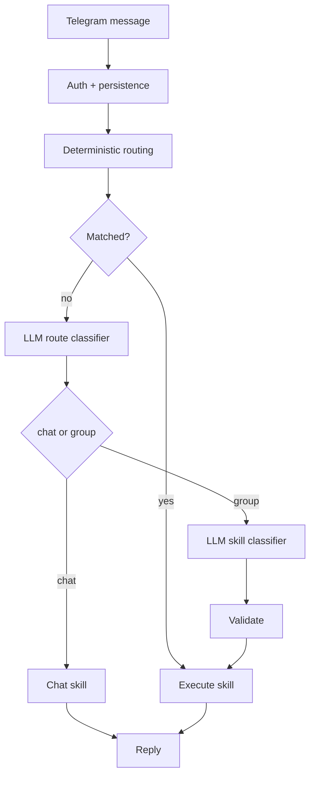

# openLight


Telegram-first local agent for Raspberry Pi.

Deterministic host skills, SQLite state, and just enough LLM.

`openLight` is a small Go runtime for a very specific job: expose a narrow set of useful host skills through Telegram, keep routing deterministic, and use an LLM only where natural language actually helps.

[Architecture](./ARCHITECTURE.md) · [Config Templates](./configs) · [Systemd Unit](./deployments/systemd/openlight-agent.service) · [Docker Compose for Ollama](./deployments/docker/ollama-compose.yaml)

## At A Glance

| Area | Choice |
| --- | --- |
| Language | Go |
| Runtime | single binary |
| Storage | SQLite |
| Interface | Telegram |
| LLM providers | Ollama, OpenAI, generic HTTP |
| Routing model | deterministic first, LLM fallback |
| Deployment target | Raspberry Pi and small Linux hosts |
| Process model | systemd-friendly |

## Why openLight

Most agent projects start with autonomy and then try to add safety back in.  
`openLight` does the opposite:

- deterministic routing first
- LLM fallback second
- one small binary
- SQLite persistence
- Raspberry Pi-friendly deployment
- narrow, auditable skills instead of general shell access

This makes it a good fit for:

- Raspberry Pi home servers
- Telegram-based status and maintenance bots
- local-first assistants with Ollama
- simple remote ops with OpenAI as a fallback provider

## Design Position

| openLight | General-purpose agent stacks |
| --- | --- |
| Telegram-first host assistant | broad multi-tool autonomy |
| deterministic routing first | often LLM-first orchestration |
| explicit skills and groups | generic tool surfaces |
| single Go binary | larger runtime stacks |
| Raspberry Pi-friendly deploy | server or dev-machine oriented |
| SQLite state and simple ops | broader platform concerns |

## Highlights

- `files` skills: `file_list`, `file_read`, `file_write`, `file_replace`
- `workbench` skills: `exec_code`, `exec_file`, `workspace_clean`
- `system` skills: `status`, `cpu`, `memory`, `disk`, `uptime`, `hostname`, `ip`, `temperature`
- `services` skills: `service_list`, `service_status`, `service_logs`, `service_restart`
- `notes` skills: `note_add`, `note_list`, `note_delete`
- `chat` mode: free-form fallback when no tool matches
- two-stage LLM routing: route to group, then choose one concrete skill
- local or remote LLM providers: Ollama, OpenAI, or generic HTTP
- polling and webhook Telegram transports
- Raspberry Pi deploy scripts and systemd unit included

## What It Feels Like

```text
You: покажи общий статус
Bot: Hostname: raspberry
CPU: 2.0%
Memory: 1.9 GiB used / 7.9 GiB total
Disk: 864.1 GiB free / 916.3 GiB total
Uptime: 2d 4h 11m
Temperature: 58.7C
```

```text
You: покажи логи tailscale
Bot: Logs for tailscale:
...
```

```text
You: read /etc/hostname
Bot: Contents of /etc/hostname:
raspberrypi
```

```text
You: добавь заметку купить ssd
Bot: Saved note #3
```

```text
You: run python:
print("hello")
Bot: Temporary code: /tmp/openlight/run-abc123.py
Runtime: python
Output:
hello
```

```text
You: привет, как дела
Bot: Привет. Чем помочь?
```

## Runtime Model

The core idea is simple:

`deterministic routing first, LLM second`



What the LLM does here:

- decide `chat` vs one skill group
- choose one concrete skill in that group
- extract minimal arguments

What the LLM does not do:

- execute arbitrary shell commands directly
- plan long tool chains
- bypass validation
- access arbitrary shell tools outside registered skills

For the full breakdown, see [ARCHITECTURE.md](./ARCHITECTURE.md).

## Quick Start

1. Initialize a config:

```bash
make init-rpi-config
```

2. Fill in:

- `telegram.bot_token`
- `auth.allowed_user_ids`
- `auth.allowed_chat_ids`
- `files.allowed` with the safe roots you want the bot to touch
- `workbench.*` if you want restricted code execution or allowed script runs

3. Pick an LLM provider:

- `ollama` for local inference
- `openai` for hosted inference
- `generic` for a custom HTTP adapter

4. Deploy:

```bash
make deploy-rpi-all
ssh pi@raspberrypi.local "journalctl -u openlight-agent -f"
```

Config templates:

- [configs/agent.example.yaml](./configs/agent.example.yaml)
- [configs/agent.openai.example.yaml](./configs/agent.openai.example.yaml)
- [configs/agent.rpi.ollama.example.yaml](./configs/agent.rpi.ollama.example.yaml)

## LLM Setup

Ollama example:

```yaml
llm:
  enabled: true
  provider: "ollama"
  endpoint: "http://127.0.0.1:11434"
  model: "qwen2.5:0.5b"
  execute_threshold: 0.80
  mutating_execute_threshold: 0.95
  clarify_threshold: 0.60
  decision_input_chars: 160
  decision_num_predict: 128

chat:
  history_limit: 6
  history_chars: 900
  max_response_chars: 400
```

OpenAI example:

```yaml
llm:
  enabled: true
  provider: "openai"
  endpoint: "https://api.openai.com/v1"
  model: "gpt-4o-mini"
  api_key: ""
  execute_threshold: 0.80
  mutating_execute_threshold: 0.95
  clarify_threshold: 0.60
  decision_input_chars: 160
  decision_num_predict: 128
```

Notes:

- `chat.*` affects only free-form chat
- `llm.decision_*` affects only structured routing
- the same `llm.model` is used for route classification and skill classification
- `OPENAI_API_KEY` can be used instead of `llm.api_key`

Safe file access example:

```yaml
files:
  allowed:
    - /tmp/openlight
    - /home/pi/scripts
    - /home/pi/openlight-work
  max_read_bytes: 4096
  list_limit: 40
```

Restricted workbench example:

```yaml
workbench:
  enabled: true
  workspace_dir: "/tmp/openlight"
  allowed_runtimes:
    - python
    - sh
  allowed_files:
    - /usr/bin/uptime
  max_output_bytes: 8192
```

## Telegram Modes

`openLight` supports:

- `telegram.mode: "polling"`
- `telegram.mode: "webhook"`

Webhook mode needs a public `https://...` URL that Telegram can reach.

Example:

```yaml
telegram:
  bot_token: "123456:replace-me"
  api_base_url: "https://api.telegram.org"
  mode: "webhook"
  poll_timeout: 25s
  webhook:
    url: "https://bot.example.com/openlight/webhook"
    listen_addr: ":8081"
    secret_token: "replace-me"
    drop_pending_updates: false
```

## Skill Guide

You can call explicit skills in three ways:

- plain command, for example `read /tmp/openlight/app.conf`
- slash command, for example `/read /tmp/openlight/app.conf`
- natural language when LLM routing is enabled

At a glance:

| Group | Skills |
| --- | --- |
| `files` | `file_list`, `file_read`, `file_write`, `file_replace` |
| `workbench` | `exec_code`, `exec_file`, `workspace_clean` |
| `services` | `service_list`, `service_status`, `service_logs`, `service_restart` |
| `system` | `status`, `cpu`, `memory`, `disk`, `uptime`, `hostname`, `ip`, `temperature` |
| `notes` | `note_add`, `note_list`, `note_delete` |
| `core` | `start`, `help`, `skills`, `ping` |
| `chat` | `chat` |

<details>
<summary><strong>Files</strong> — read, list, write, and replace text in whitelisted paths</summary>

Configure `files.allowed` first.

| Skill | What it does | Command shape | Example |
| --- | --- | --- | --- |
| `file_list` | list one allowed directory or show allowed roots | `files [path]` | `files /tmp/openlight` |
| `file_read` | read a text file | `read <path>` | `read /tmp/openlight/app.conf` |
| `file_write` | create or overwrite a text file | `write <path> :: <content>` | `write /tmp/openlight/hello.txt :: hello world` |
| `file_replace` | replace text inside a file | `replace <old> with <new> in <path>` | `replace 8080 with 8081 in /tmp/openlight/app.conf` |

Notes:

- file access stays inside `files.allowed`
- symlink-resolved paths must still remain inside an allowed root
- reads are capped by `files.max_read_bytes`

</details>

<details>
<summary><strong>Workbench</strong> — run temporary code or exact allowlisted executables</summary>

Configure `workbench.enabled: true` first.

| Skill | What it does | Command shape | Example |
| --- | --- | --- | --- |
| `exec_code` | write temporary code into the workspace and run it | `exec_code <runtime> :: <code>` or `run <runtime>:` | `exec_code python :: print("hello")` |
| `exec_file` | run one exact allowlisted file | `exec_file <path>` or `run <path>` | `run /usr/bin/uptime` |
| `workspace_clean` | remove temporary files from the workbench workspace | `workspace_clean` | `workspace_clean` |

Notes:

- temporary code is written only inside `workbench.workspace_dir`
- only runtimes from `workbench.allowed_runtimes` can be used for `exec_code`
- `exec_file` can run only exact paths from `workbench.allowed_files`
- stdout and stderr are capped by `workbench.max_output_bytes`

</details>

<details>
<summary><strong>Services</strong> — inspect, log, and restart explicitly allowed services</summary>

Configure `services.allowed` first.

| Skill | What it does | Command shape | Example |
| --- | --- | --- | --- |
| `service_list` | list allowed services and current state | `services` | `services` |
| `service_status` | show one service status | `service [name]` or `status [name]` | `service tailscale` |
| `service_logs` | show recent service logs | `logs [name]` | `logs tailscale` |
| `service_restart` | restart one allowed service | `restart <name>` | `restart tailscale` |

</details>

<details>
<summary><strong>System</strong> — host overview and low-level machine metrics</summary>

| Skill | What it does | Command shape | Example |
| --- | --- | --- | --- |
| `status` | compact host overview | `status` | `status` |
| `cpu` | CPU usage | `cpu` | `cpu` |
| `memory` | RAM usage | `memory` | `memory` |
| `disk` | root filesystem usage | `disk` | `disk` |
| `uptime` | system uptime | `uptime` | `uptime` |
| `hostname` | hostname | `hostname` | `hostname` |
| `ip` | local IPv4 addresses | `ip` | `ip` |
| `temperature` | device temperature when available | `temperature` | `temperature` |

</details>

<details>
<summary><strong>Notes</strong> — small SQLite-backed memory</summary>

| Skill | What it does | Command shape | Example |
| --- | --- | --- | --- |
| `note_add` | save a short note | `note <text>` | `note buy milk` |
| `note_list` | list recent notes | `notes` | `notes` |
| `note_delete` | delete a note by id | `note_delete <id>` | `note_delete 3` |

</details>

<details>
<summary><strong>Core And Chat</strong> — discovery, help, healthcheck, and forced LLM chat</summary>

| Skill | What it does | Command shape | Example |
| --- | --- | --- | --- |
| `start` | show quick intro | `start` | `start` |
| `skills` | show groups or expand one group | `skills [group|skill]` | `skills files` |
| `help` | show one skill in detail | `help <skill>` | `help exec_code` |
| `ping` | connectivity check | `ping` | `ping` |
| `chat` | force free-form LLM chat | `chat <message>` | `chat explain why cpu load matters` |

</details>

Natural-language requests also work when LLM routing is enabled, for example:

```text
можешь показать содержимое файла /tmp/openlight/app.conf?
покажи логи tailscale
запусти python код print("hello")
```

The deeper routing and safety notes live in [ARCHITECTURE.md](./ARCHITECTURE.md).

## Local Ollama

Local Ollama compose lives in [deployments/docker/ollama-compose.yaml](./deployments/docker/ollama-compose.yaml).

```bash
make ollama-up
make ollama-pull
curl http://127.0.0.1:11434/api/generate \
  -d '{"model":"qwen2.5:0.5b","prompt":"reply with ok","stream":false}'
```

## Build, Test, Deploy

Build:

```bash
make build-rpi
```

Run tests:

```bash
GOCACHE=/tmp/go-build GOSUMDB=off go test ./...
```

Run real Ollama smoke tests:

```bash
make ollama-up
make ollama-pull
make test-e2e-ollama
make ollama-down
```

Deploy helpers:

- [Makefile](./Makefile)
- [scripts/deploy-rpi.sh](./scripts/deploy-rpi.sh)
- [scripts/deploy-rpi-config.sh](./scripts/deploy-rpi-config.sh)
- [scripts/deploy-rpi-service.sh](./scripts/deploy-rpi-service.sh)

Deploy layout:

- config on Pi: `/etc/openlight/agent.yaml`
- binary on Pi: `/home/<user>/openlight-agent`
- systemd unit: `/etc/systemd/system/openlight-agent.service`

Useful commands:

```bash
make build-rpi
make deploy-rpi-config
make deploy-rpi
make deploy-rpi-service
make deploy-rpi-all
```

## Extending

`openLight` is designed to grow in two directions:

- new LLM providers through [internal/llm/factory.go](./internal/llm/factory.go)
- new skills and modules through [internal/skills/module.go](./internal/skills/module.go)

The practical extension guide lives in [ARCHITECTURE.md](./ARCHITECTURE.md).

## Security Notes

- Telegram access is controlled by user/chat whitelist checks
- file access is limited to explicitly whitelisted roots
- workbench execution is limited to explicitly allowed runtimes, files, and one workspace directory
- service management is limited to explicitly allowed services
- there is still no unrestricted shell access in the bot runtime

## Roadmap

### v0.0.1

- Telegram bot transport
- whitelist auth
- SQLite persistence
- file list/read/write/replace skills with whitelisted roots
- restricted workbench skills for temp code and allowlisted file execution
- system metrics skills
- service skills
- notes add/list/delete
- rule-based routing
- Ollama chat and structured decision fallback
- Raspberry Pi deploy scripts and systemd unit

### Next

- richer structured decision routing for local LLMs
- better observability and runtime diagnostics
- alerts and background checks
- process and container management skills
- web search skill
- richer service and host management skills

## License

MIT. See [LICENSE](./LICENSE).
