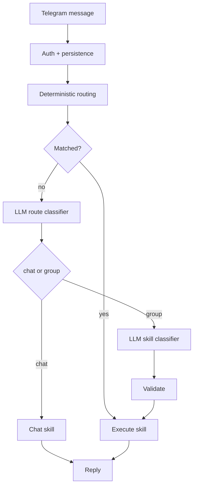

# openLight


Tiny AI control plane for your personal infrastructure.

`openLight` keeps host access explicit and auditable, stores state in SQLite, and uses an LLM only for natural-language routing and chat. It is not a general-purpose shell agent.

[Architecture](./ARCHITECTURE.md) · [Changelog](./CHANGELOG.md) · [Install on Raspberry Pi](#raspberry-pi-setup) · [Configs](./configs/) · [Systemd Unit](./deployments/systemd/openlight-agent.service)

## Why

`openLight` is built for a narrow operating model:

- deterministic routing before any LLM fallback
- explicit, auditable skills instead of general shell access
- one Go binary plus one YAML config
- SQLite persistence instead of a larger service footprint
- deployment that fits Raspberry Pi and other modest Linux hosts

Best suited for:

- Raspberry Pi home servers
- Telegram-based maintenance bots
- local-first assistants backed by Ollama
- simple remote ops with OpenAI or a custom HTTP LLM adapter

## At a Glance

| Area | Choice |
| --- | --- |
| Interface | Telegram |
| Runtime | single Go binary |
| State | SQLite |
| Routing | deterministic first, optional two-stage LLM fallback |
| LLM providers | Ollama, OpenAI, generic HTTP |
| Host actions | explicit file, system, service, notes, and optional workbench skills |
| Deployment | systemd-friendly, Raspberry Pi-first |

## How It Works

Each message goes through auth, persistence, deterministic routing, optional LLM fallback, validation, skill execution, and reply delivery.
If `llm.enabled: false`, the runtime stays deterministic-only and the `chat` skill is not registered.



The LLM is intentionally constrained:

- it can classify `chat` vs a skill group
- it can choose one concrete skill inside the chosen group
- it can extract minimal arguments for that skill
- it cannot bypass validation or access arbitrary shell tools

See [ARCHITECTURE.md](./ARCHITECTURE.md) for the full runtime reference.

## Quick Start

Requirements:

- Go 1.25+
- Telegram bot token
- Linux host for systemd-backed service skills
- optional: Ollama or an OpenAI API key

1. Copy a config template to `agent.yaml`.

| Template | Use when |
| --- | --- |
| [configs/agent.example.yaml](./configs/agent.example.yaml) | minimal baseline, LLM disabled |
| [configs/agent.openai.example.yaml](./configs/agent.openai.example.yaml) | OpenAI-backed routing and chat |
| [configs/agent.rpi.ollama.example.yaml](./configs/agent.rpi.ollama.example.yaml) | Raspberry Pi deployment with local Ollama |

```bash
cp configs/agent.example.yaml ./agent.yaml
# or:
cp configs/agent.openai.example.yaml ./agent.yaml
```

For Raspberry Pi, use [Raspberry Pi Setup](#raspberry-pi-setup).
`make init-rpi-config` creates `configs/agent.rpi.yaml` from the bundled Pi template.

2. Fill the required settings.

- `telegram.bot_token`
- at least one of `auth.allowed_user_ids` or `auth.allowed_chat_ids`
- `storage.sqlite_path`
- `files.allowed` for safe file access
- `services.allowed` for allowed systemd services
- `workbench.*` only if you want temporary code execution or allowlisted executables
- `llm.*` and `chat.*` only if you want LLM routing and chat

Keep runtime secrets out of version control.
For OpenAI, prefer `OPENAI_API_KEY` over committing `llm.api_key`.

3. Run the agent.

```bash
go run ./cmd/agent -config ./agent.yaml
```

Useful first commands:

- `/skills`
- `/help status`
- `/status`
- `read /tmp/openlight/app.conf`

Natural-language routing such as `show tailscale logs` or `прочитай /etc/hostname` is available only when `llm.enabled: true`.

## Raspberry Pi Setup

<details>
<summary><strong>Open the short install path</strong> — from clone to a running systemd service</summary>

This path assumes:

- you run the deploy commands from your laptop or workstation
- the Pi is reachable over SSH
- the SSH user has `sudo`
- optional for local LLMs: Docker with the `docker compose` plugin is installed on the Pi

1. Create the Raspberry Pi config and edit it.

```bash
make init-rpi-config
```

Then open `configs/agent.rpi.yaml` and set at least:

- `telegram.bot_token`
- `auth.allowed_user_ids` or `auth.allowed_chat_ids`
- `storage.sqlite_path`
- `files.allowed`
- `services.allowed`

If you do not want Ollama on the Pi, either set `llm.enabled: false` or start from `configs/agent.openai.example.yaml` instead.

2. Point the deploy helpers at your Pi.

```bash
export PI_USER=pi
export PI_HOST=raspberrypi.local
export PI_DEST_DIR=/home/pi
```

3. Optional: if you want local Ollama on the Pi, start it there first.

```bash
scp deployments/docker/ollama-compose.yaml "$PI_USER@$PI_HOST:/home/$PI_USER/ollama-compose.yaml"
ssh "$PI_USER@$PI_HOST" "docker compose -f /home/$PI_USER/ollama-compose.yaml up -d ollama"
ssh "$PI_USER@$PI_HOST" "docker compose -f /home/$PI_USER/ollama-compose.yaml run --rm ollama-pull"
```

The bundled compose file pulls `qwen2.5:0.5b`.
Skip this step if you use OpenAI or deterministic-only mode.

4. Upload config, binary, and systemd unit.

```bash
make deploy-rpi-all
```

This will:

- upload `configs/agent.rpi.yaml` to `/etc/openlight/agent.yaml`
- build `openlight-agent` for `linux/arm64`
- copy the binary to `/home/pi/openlight-agent`
- install or restart `openlight-agent.service`

5. Check that the service is alive.

```bash
ssh "$PI_USER@$PI_HOST" "systemctl status openlight-agent --no-pager"
ssh "$PI_USER@$PI_HOST" "journalctl -u openlight-agent -f"
```

6. Talk to the bot in Telegram.

- `/skills`
- `/status`
- `logs tailscale`

</details>

## Configuration

### Surface

| Section | Purpose |
| --- | --- |
| `telegram.*` | transport settings, polling or webhook mode |
| `auth.*` | user and chat allowlists |
| `storage.*` | SQLite database location |
| `files.*` | allowed roots and read/list limits |
| `services.*` | allowed systemd services and log line limits |
| `workbench.*` | optional temporary code execution and allowlisted files |
| `llm.*` | optional LLM provider, thresholds, and routing limits |
| `chat.*` | free-form chat history and response bounds |
| `agent.*` | request timeout |
| `log.*` | log verbosity |

### Telegram

`openLight` supports two transport modes:

- `telegram.mode: "polling"` for the simplest deployment
- `telegram.mode: "webhook"` for public HTTPS deployments

Webhook mode requires:

- a public `https://...` URL in `telegram.webhook.url`
- a local listen address in `telegram.webhook.listen_addr`
- a Telegram-reachable endpoint path

Using `telegram.webhook.secret_token` is recommended for webhook deployments.

### LLM

LLM support is optional.
When enabled, `openLight` supports:

- `ollama` for local inference
- `openai` for the OpenAI Responses API
- `generic` for a custom HTTP adapter

The fastest path is to start from one of the example configs instead of copying inline YAML into the README.

Notes:

- the same `llm.model` is used for route classification, skill classification, and chat
- `chat.*` affects only free-form chat
- `llm.decision_*` affects only routing and skill selection
- `OPENAI_API_KEY` overrides `llm.api_key`

### Safety Boundaries

The config defines the agent's safety envelope:

| Setting | Effect |
| --- | --- |
| `files.allowed` | limits file read/write access to explicit roots |
| `services.allowed` | limits service inspection and restart to explicit systemd units |
| `workbench.enabled` | controls whether temporary code execution is available at all |
| `workbench.allowed_runtimes` | limits `exec_code` runtimes |
| `workbench.allowed_files` | limits `exec_file` to exact paths |

## Built-in Skills

| Group | Available when | Skills |
| --- | --- | --- |
| `core` | always | `start`, `help`, `skills`, `ping` |
| `system` | always | `status`, `cpu`, `memory`, `disk`, `uptime`, `hostname`, `ip`, `temperature` |
| `files` | always | `file_list`, `file_read`, `file_write`, `file_replace` |
| `services` | always | `service_list`, `service_status`, `service_logs`, `service_restart` |
| `notes` | always | `note_add`, `note_list`, `note_delete` |
| `workbench` | when `workbench.enabled: true` | `exec_code`, `exec_file`, `workspace_clean` |
| `chat` | when `llm.enabled: true` | `chat` |

<details>
<summary><strong>Files</strong> — read, list, write, and replace text in whitelisted paths</summary>

Configure `files.allowed` first.

| Skill | What it does | Command shape | Example |
| --- | --- | --- | --- |
| `file_list` | list one allowed directory or show allowed roots | `files [path]` | `files /tmp/openlight` |
| `file_read` | read a text file | `read <path>` | `read /tmp/openlight/app.conf` |
| `file_write` | create or overwrite a text file | `write <path> :: <content>` | `write /tmp/openlight/hello.txt :: hello world` |
| `file_replace` | replace text inside a file | `replace <old> with <new> in <path>` | `replace 8080 with 8081 in /tmp/openlight/app.conf` |

</details>

<details>
<summary><strong>Workbench</strong> — run temporary code or exact allowlisted executables</summary>

Configure `workbench.enabled: true` first.

| Skill | What it does | Command shape | Example |
| --- | --- | --- | --- |
| `exec_code` | write temporary code into the workspace and run it | `exec_code <runtime> :: <code>` or `run <runtime>:` | `exec_code python :: print("hello")` |
| `exec_file` | run one exact allowlisted file | `exec_file <path>` or `run <path>` | `run /usr/bin/uptime` |
| `workspace_clean` | remove temporary files from the workbench workspace | `workspace_clean` | `workspace_clean` |

</details>

<details>
<summary><strong>Services</strong> — inspect, log, and restart explicitly allowed services</summary>

Configure `services.allowed` first.

| Skill | What it does | Command shape | Example |
| --- | --- | --- | --- |
| `service_list` | list allowed services and current state | `services` | `services` |
| `service_status` | show one service status | `service [name]` | `service tailscale` |
| `service_logs` | show recent service logs | `logs [name]` | `logs tailscale` |
| `service_restart` | restart one allowed service | `restart <name>` | `restart tailscale` |

</details>

<details>
<summary><strong>System</strong> — host overview and low-level machine metrics</summary>

| Skill | What it does | Command shape | Example |
| --- | --- | --- | --- |
| `status` | compact host overview | `status` | `status` |
| `cpu` | CPU usage | `cpu` | `cpu` |
| `memory` | RAM usage | `memory` | `memory` |
| `disk` | root filesystem usage | `disk` | `disk` |
| `uptime` | system uptime | `uptime` | `uptime` |
| `hostname` | hostname | `hostname` | `hostname` |
| `ip` | local IPv4 addresses | `ip` | `ip` |
| `temperature` | device temperature when available | `temperature` | `temperature` |

</details>

<details>
<summary><strong>Notes</strong> — small SQLite-backed memory</summary>

| Skill | What it does | Command shape | Example |
| --- | --- | --- | --- |
| `note_add` | save a short note | `note <text>` | `note buy milk` |
| `note_list` | list recent notes | `notes` | `notes` |
| `note_delete` | delete a note by id | `note_delete <id>` | `note_delete 3` |

</details>

<details>
<summary><strong>Core And Chat</strong> — discovery, help, healthcheck, and forced LLM chat</summary>

| Skill | What it does | Command shape | Example |
| --- | --- | --- | --- |
| `start` | show a short intro | `start` | `start` |
| `skills` | show groups or expand one group | `skills [group|skill]` | `skills files` |
| `help` | show one skill in detail | `help [skill]` | `help exec_code` |
| `ping` | connectivity check | `ping` | `ping` |
| `chat` | force free-form LLM chat | `chat <message>` | `chat explain why cpu load matters` |

</details>

Examples of deterministic commands:

```text
read /tmp/openlight/app.conf
replace 8080 with 8081 in /tmp/openlight/app.conf
logs tailscale
run /usr/bin/uptime
note buy milk
```

Commands can be sent as slash commands, explicit command text, or natural language when LLM routing is enabled.

## Development

Local development:

```bash
go test ./...
go run ./cmd/agent -config ./agent.yaml
```

Optional Ollama smoke test on the current machine:

```bash
make ollama-up
make ollama-pull
make test-e2e-ollama
make ollama-down
```

Cross-compile for Raspberry Pi:

```bash
make build-rpi
```

`make build` and `make build-rpi` target `linux/arm64` by default.
For local development on another host, use `go run` or `go build` directly.

Deploy helpers:

- [Makefile](./Makefile)
- [scripts/run-local.sh](./scripts/run-local.sh)
- [scripts/deploy-rpi.sh](./scripts/deploy-rpi.sh)
- [scripts/deploy-rpi-config.sh](./scripts/deploy-rpi-config.sh)
- [scripts/deploy-rpi-service.sh](./scripts/deploy-rpi-service.sh)

For the end-to-end Raspberry Pi install flow, use [Raspberry Pi Setup](#raspberry-pi-setup) above.

Deploy layout on the Pi:

- config on Pi: `/etc/openlight/agent.yaml`
- binary on Pi: `/home/<user>/openlight-agent`
- systemd unit: `/etc/systemd/system/openlight-agent.service`

## Security Model

- Telegram access is limited by user and chat allowlists
- file access is limited to explicitly whitelisted roots
- service actions are limited to explicitly allowed systemd units
- workbench execution is limited to one workspace, allowed runtimes, and exact allowed files
- the LLM cannot bypass validation or create arbitrary shell access

## Extending openLight

`openLight` is designed to stay small, but it is intentionally extensible:

- add new skill bundles through [internal/skills/module.go](./internal/skills/module.go)
- add new LLM providers through [internal/llm/factory.go](./internal/llm/factory.go)

See [ARCHITECTURE.md](./ARCHITECTURE.md) for the runtime model, safety boundaries, and extension points.

## License

MIT. See [LICENSE](./LICENSE).
